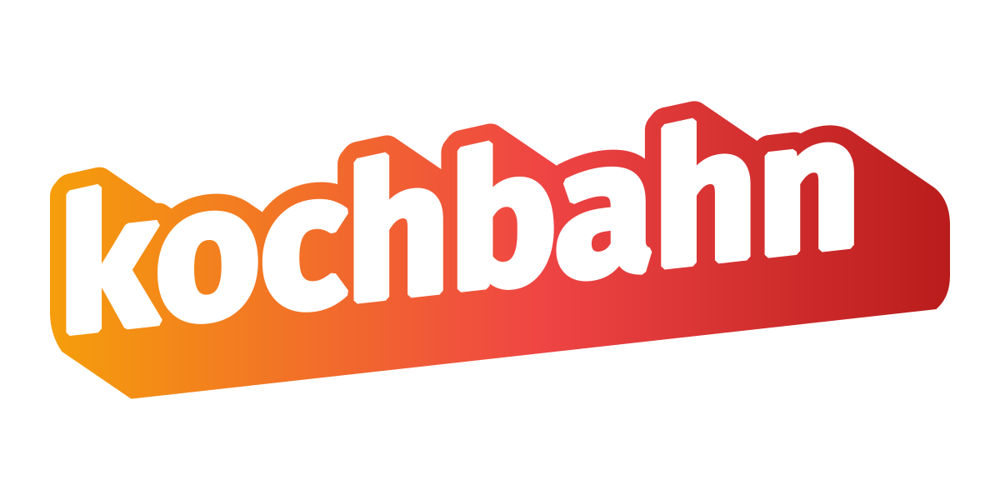
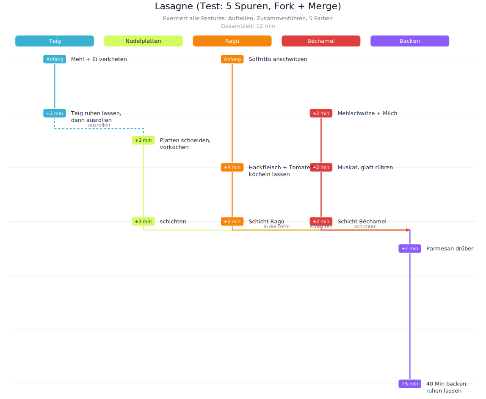

<p align="center">
  
</p>

<p align="center">
  <a href="https://github.com/StephanSchmidt/kochbahn/actions/workflows/ci.yml"></a>
</p>

Renders a multi-lane recipe from a YAML config to a top-down SVG timeline
suitable for printing in a book. Each **lane** is a parallel cooking process;
lanes can **fork** (one process splits) and **merge** (processes converge, e.g.
*"Nudeln in Pfanne"*). The vertical axis is time in minutes.

The name is German — *Koch* ("cook") + *Bahn* ("lane/track") — the project's
central abstraction. Recipe content and labels in the examples are German.

<p align="center">
  
</p>

## Install

```
go install github.com/StephanSchmidt/kochbahn@latest
```

Or build from source: `make build` (produces a `kochbahn` binary).

## Usage

```
go run . -in examples/salbeibutter.yaml -out salbei.svg
go run . -in recipe.yaml            # -> recipe.svg
go run . -in recipe.yaml -out -     # SVG to stdout
```

Installed as a binary, replace `go run .` with `kochbahn`.

### Flags

Every run **validates the recipe first and only renders if it is clean** — a bad
recipe prints a list of `file:line` problems (all at once, not just the first)
and writes no half-drawn SVG.

| Flag | Default | Effect |
|------|---------|--------|
| `-in PATH` | — | YAML recipe to render (required) |
| `-out PATH` | `<in>.svg` | output path; `-` writes SVG to stdout |
| `-check` | off | validate only — report problems and render nothing |
| `-theme NAME` | `default` | lane color preset: `default`, `warm`, `cool`, `high-contrast`, `mono` (aliases: `print-bw`, `grayscale`). `mono` flattens **all** lanes to gray, even explicit colors, for cheap black-and-white book printing |
| `-lang CODE` | `de` | language for the few generated labels (`Anfang`/`Gesamtzeit`): `de`, `en` |
| `-portions N` | off | rescale `{amount}` markup to `N` portions (needs `yield:` in the recipe) |

```
kochbahn -in recipe.yaml -check                 # lint without rendering
kochbahn -in recipe.yaml -theme print-bw        # grayscale for print
kochbahn -in recipe.yaml -portions 4            # scale a 2-portion recipe to 4
kochbahn -in recipe.yaml -lang en               # English generated labels
```

## Examples

Persistent, editable examples live in `examples/` (YAML + rendered SVG), spanning
simple to complex:

| File | Lanes | Shows |
|------|-------|-------|
| `examples/salbeibutter.yaml` | 3 | prep lane + two merges (Nudelwasser, then Nudeln) |
| `examples/fruehstueck.yaml`  | 3 | three lanes converging on a plate |
| `examples/lasagne.yaml`      | 5 | a fork + three merges, all colors |

Re-render them all after an edit:

```
make examples      # renders examples/*.yaml -> examples/*.svg
```

Time is shown per step as a **relative pill** above each node: the earliest action
reads `Anfang`; a lane's first action reads `+N min` from the start (when to fire
it up); later actions read `+N min` since that lane's previous step. The header
also shows the recipe's derived total time (`Gesamtzeit: N min`), and the kochbahn
wordmark is embedded in the top-right corner of every timeline.

## Config format

```yaml
title: "Salbeibutter-Pasta"
subtitle: "2 Portionen"
yield: 2                                          # optional; portions the {amounts} are written for
time: { from: 0, to: 9, tick: 1, unit: "min" }   # optional; derived from steps

lanes:                       # order = left→right columns; max 5
  - id: nudeln
    label: "Wasser / Nudeln"
    color: "#3b82f6"         # optional; palette fills the rest
  - id: sosse
    label: "Soße"

steps:
  - lane: nudeln
    at: 0
    text: "{200 g} Nudeln rein"   # \n = line break; {…} = scalable amount
  - lane: nudeln
    at: 7
    text: "abgießen"
    merge_into: sosse        # this lane converges into 'sosse'
    arrow_label: "Nudeln in Pfanne"
  # fork_to: [laneA, laneB]  # one step splitting into several lanes

labels:                      # optional; override generated strings
  start: "Anfang"            #   (also: total)
```

### Scalable amounts

Wrap an amount in `{…}` to make it scale with `-portions`: `{200 g}`, `{1/2 TL}`,
`{1,5 l}`, `{½ EL}`, `{2-3}` (ranges scale both ends). The braces are markup and
never appear in the output — with no `-portions` they are simply unwrapped, so
the recipe renders at its written `yield`. Unmarked numbers (a cooking time like
`40 Min`) are left untouched, so nothing is rescaled by accident.

## Architecture

A strict three-stage pipeline, each stage ignorant of the next's concerns:

```
YAML ──▶ recipe model ──▶ layout model ──▶ SVG bytes
         (semantics)      (geometry)        (render)
```

- `internal/recipe` — domain model + YAML load/validate. No pixels.
- `internal/layout` — renderer-agnostic geometry (`Build(recipe, Style) → Layout`
  of rails/nodes/labels/connectors/ticks/headers). No SVG.
- `internal/render` — maps a `Layout` to SVG. No recipe semantics.

A future PNG/canvas backend only needs to consume the `layout.Layout`.

## Test

```
go test ./...
```

Fixtures: `testdata/salbeibutter.yaml` (2 lanes, one merge),
`testdata/fork-merge.yaml` (5 lanes, a fork and three merges — exercises every
feature), and `testdata/broken.yaml` (deliberately invalid — checks that
validation reports every problem at once, with line numbers).

## License

[MIT](LICENSE) © 2026 Stephan Schmidt
